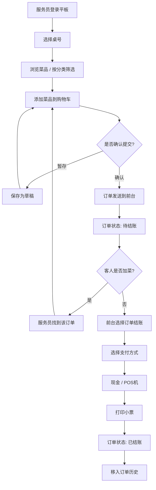
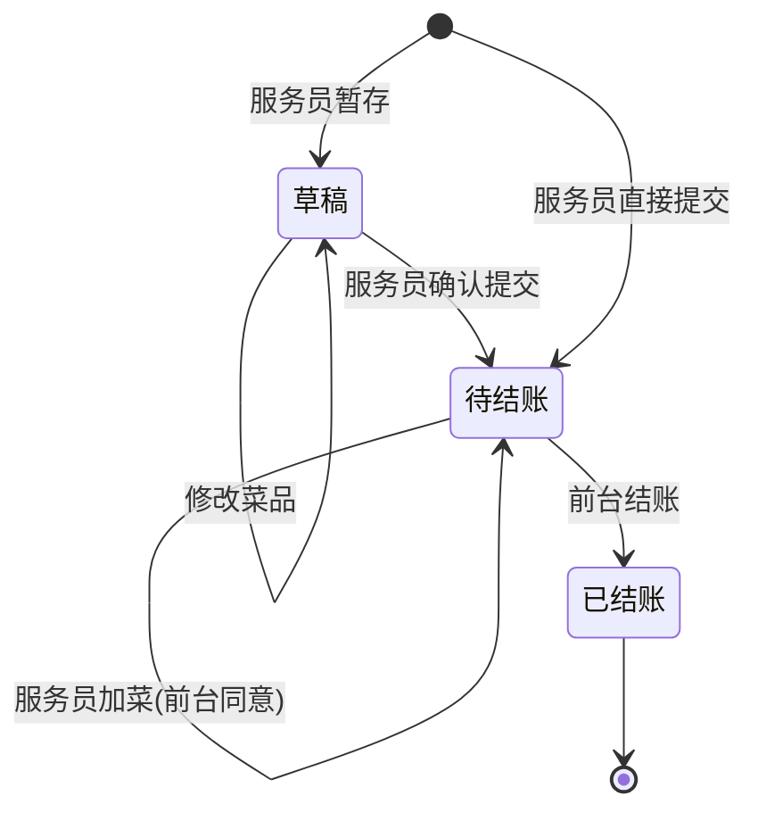

# 餐厅智能点餐系统 — 产品需求文档（PRD）

> 版本：v1.0 | 日期：2026-05-19 | 状态：草案

---

## 1. 项目概述

### 1.1 项目背景

传统餐厅点餐依赖纸质菜单和人工传话，存在以下痛点：

- 服务员在餐桌与前台之间频繁往返，效率低下
- 手写菜单字迹不清，容易出错、漏单
- 前台结账需手动汇总，高峰期排队严重
- 缺乏数据沉淀，无法分析菜品销量和服务员业绩

本项目旨在用一套**平板点餐 + 前台管理**的双端系统替代传统流程，提升餐厅运营效率。

### 1.2 项目目标

| 目标 | 描述 |
|------|------|
| 提升点餐效率 | 服务员平板点餐，实时同步到前台，减少传话环节 |
| 降低出错率 | 电子菜单、自动算价、订单不可篡改，杜绝人为差错 |
| 加速结账流程 | 前台一键调取订单，自动算总价+找零，支持多种支付方式 |
| 数据驱动经营 | 自动生成销售报表，辅助菜品调整和人员考核 |

### 1.3 系统边界

- **包含**：点餐、订单管理、菜品管理、结账、报表统计
- **不包含**：厨房打印（后续对接）、会员管理、库存预警、外卖对接、扫码点餐

---

## 2. 用户角色

| 角色 | 使用端 | 说明 |
|------|--------|------|
| 服务员 | 平板 APK | 负责餐桌点餐、修改订单，每人独立账号，只能操作自己的订单 |
| 前台收银员 | Web 管理后台 | 负责结账、查看所有订单、管理菜品、查看报表 |
| 管理员 | Web 管理后台 | 拥有所有权限，包括员工账号管理 |

其中**前台收银员**和**管理员**共用同一 Web 后台，通过权限区分。

---

## 3. 业务流程图

### 3.1 整体流程



### 3.2 订单状态流转



---

## 4. 功能需求清单

### 4.1 平板端（服务员 APK）

#### 4.1.1 登录

| 编号 | 功能 | 描述 | 优先级 |
|------|------|------|--------|
| F-W-01 | 服务员登录 | 输入工号+密码登录，登录后记住状态（7天有效） | P0 |
| F-W-02 | 自动登录 | Token 有效期内免密登录 | P1 |

#### 4.1.2 桌号选择

| 编号 | 功能 | 描述 | 优先级 |
|------|------|------|--------|
| F-W-03 | 选择桌号 | 1-50 号桌下拉选择，大按钮触屏友好 | P0 |
| F-W-04 | 显示桌号状态 | 有空桌/用餐中/待结账三种状态标识 | P2 |
| F-W-05 | 切换桌号 | 可随时切换桌号，每个桌号的购物车独立保存 | P0 |

#### 4.1.3 菜品浏览与点餐

| 编号 | 功能 | 描述 | 优先级 |
|------|------|------|--------|
| F-W-06 | 分类筛选 | 全部/热菜/凉菜/酒水/主食 等分类切换 | P0 |
| F-W-07 | 菜品网格 | 大卡片展示：图片、名称、价格，触屏大按钮 | P0 |
| F-W-08 | 菜品搜索 | 支持菜品名称模糊搜索 | P1 |
| F-W-09 | 加入购物车 | 点击菜品添加到购物车，已存在的增加数量 | P0 |
| F-W-10 | 购物车管理 | 修改数量（+/-）、删除单品、一键清空 | P0 |
| F-W-11 | 已售罄标识 | 库存为0的菜品置灰，不可点击 | P1 |

#### 4.1.4 订单管理

| 编号 | 功能 | 描述 | 优先级 |
|------|------|------|--------|
| F-W-12 | 草稿暂存 | 未完成的订单可保存为草稿，稍后继续 | P0 |
| F-W-13 | 确认提交 | 提交后订单发送到前台，状态变为"待结账" | P0 |
| F-W-14 | 我的订单 | 查看自己名下所有订单（草稿+待结账列表） | P0 |
| F-W-15 | 继续点餐 | 对未结账订单继续添加菜品 | P0 |
| F-W-16 | 订单详情 | 查看订单完整菜品清单和金额 | P1 |

#### 4.1.5 约束

- 服务员只能看到和操作**自己**创建的订单
- 订单确认提交后**不可修改**（或需前台在管理后台同意后方可修改）
- 服务员**不能结账**

---

### 4.2 前台管理端（Web）

#### 4.2.1 登录与权限

| 编号 | 功能 | 描述 | 优先级 |
|------|------|------|--------|
| F-M-01 | 账号登录 | 管理员/收银员通过用户名+密码登录 | P0 |
| F-M-02 | 退出登录 | 清除登录状态 | P0 |

#### 4.2.2 员工/账号管理

| 编号 | 功能 | 描述 | 优先级 |
|------|------|------|--------|
| F-M-03 | 员工列表 | 表格展示所有员工：工号、姓名、角色、状态 | P0 |
| F-M-04 | 新增员工 | 填写工号、姓名、角色（服务员/收银员/管理员）、初始密码 | P0 |
| F-M-05 | 编辑员工 | 修改姓名、角色、状态（启用/禁用） | P0 |
| F-M-06 | 删除员工 | 禁用而非物理删除（保留历史数据关联） | P1 |
| F-M-07 | 重置密码 | 管理员重置任意员工密码 | P1 |

#### 4.2.3 待结账订单

| 编号 | 功能 | 描述 | 优先级 |
|------|------|------|--------|
| F-M-08 | 订单列表 | 所有"待结账"订单，按时间倒序 | P0 |
| F-M-09 | 按服务员筛选 | 下拉选择服务员，只看该服务员的订单 | P0 |
| F-M-10 | 按桌号筛选 | 输入桌号快速查找 | P1 |
| F-M-11 | 订单详情 | 点击查看完整菜品清单 | P0 |
| F-M-12 | 服务员统计 | 显示每个服务员的订单数量和金额汇总 | P1 |
| F-M-13 | 订单加菜 | 前台可同意服务员发起的加菜请求 | P2 |
| F-M-14 | 订单合并 | 同一桌号多个订单可合并结账 | P2 |

#### 4.2.4 结账

| 编号 | 功能 | 描述 | 优先级 |
|------|------|------|--------|
| F-M-15 | 现金支付 | 输入收款金额，自动计算找零，快捷金额按钮 | P0 |
| F-M-16 | POS机支付 | 模拟 POS 刷卡流程（预留真实POS接口） | P0 |
| F-M-17 | 打印小票 | 结账成功后模拟打印（console.log + 弹窗），预留真实打印机接口 | P0 |
| F-M-18 | 结账确认 | 二次确认防止误操作 | P0 |
| F-M-19 | 状态更新 | 结账后订单状态→"已结账"，记录支付方式、结账时间、操作人 | P0 |

#### 4.2.5 菜品管理

| 编号 | 功能 | 描述 | 优先级 |
|------|------|------|--------|
| F-M-20 | 菜品列表 | 表格展示所有菜品：名称、分类、价格、库存、状态 | P0 |
| F-M-21 | 新增菜品 | 填写名称、分类、价格、库存数量、上传图片 | P0 |
| F-M-22 | 编辑菜品 | 修改菜品信息 | P0 |
| F-M-23 | 下架/上架 | 切换菜品状态（下架后平板端不显示） | P0 |
| F-M-24 | 库存调整 | 手动修改库存数量 | P1 |
| F-M-25 | 分类筛选 | 按分类筛选 + 名称搜索 | P0 |
| F-M-26 | 图片上传 | 上传菜品图片（显示在平板端卡片上） | P1 |

#### 4.2.6 订单历史

| 编号 | 功能 | 描述 | 优先级 |
|------|------|------|--------|
| F-M-27 | 历史订单列表 | 所有"已结账"订单，按时间倒序 | P0 |
| F-M-28 | 多条件筛选 | 日期范围、服务员、桌号、支付方式 | P0 |
| F-M-29 | 订单详情 | 查看完整信息（菜品、金额、支付方式、操作人） | P1 |
| F-M-30 | 导出 Excel | 将筛选结果导出为 Excel 文件 | P1 |
| F-M-31 | 汇总数据 | 筛选条件下的订单数、总金额、平均客单价 | P0 |

#### 4.2.7 报表统计

| 编号 | 功能 | 描述 | 优先级 |
|------|------|------|--------|
| F-M-32 | 今日概览 | 今日营业额、订单数、客单价 | P0 |
| F-M-33 | 本月趋势图 | 本月每日销售额折线图 | P0 |
| F-M-34 | 菜品销量 TOP10 | 柱状图，按销售份数排名 | P0 |
| F-M-35 | 服务员业绩排行 | 按订单数/销售额排行 | P1 |
| F-M-36 | 时段分析 | 按小时统计订单量分布 | P1 |
| F-M-37 | 分类销售占比 | 饼图，按菜品分类统计销售额 | P1 |
| F-M-38 | 支付方式占比 | 饼图，现金 vs POS机 | P1 |

---

## 5. 数据表结构设计

### 5.1 employees（员工表）

| 字段 | 类型 | 说明 |
|------|------|------|
| id | INTEGER PRIMARY KEY AUTOINCREMENT | 主键 |
| username | VARCHAR(50) UNIQUE NOT NULL | 工号 |
| password | VARCHAR(255) NOT NULL | 密码（bcrypt 哈希） |
| name | VARCHAR(50) NOT NULL | 姓名 |
| role | VARCHAR(20) NOT NULL | waiter/cashier/admin |
| status | VARCHAR(10) DEFAULT 'active' | active/disabled |
| created_at | DATETIME DEFAULT CURRENT_TIMESTAMP | 创建时间 |

### 5.2 dishes（菜品表）

| 字段 | 类型 | 说明 |
|------|------|------|
| id | INTEGER PRIMARY KEY AUTOINCREMENT | 主键 |
| name | VARCHAR(100) NOT NULL | 菜品名称 |
| category | VARCHAR(50) NOT NULL | 分类（热菜/凉菜/酒水/主食等） |
| price | DECIMAL(10,2) NOT NULL | 单价（元） |
| image | VARCHAR(500) | 图片路径/URL |
| stock | INTEGER DEFAULT 0 | 库存数量 |
| status | VARCHAR(10) DEFAULT 'active' | active（上架）/inactive（下架） |
| created_at | DATETIME DEFAULT CURRENT_TIMESTAMP | 创建时间 |
| updated_at | DATETIME | 最后修改时间 |

### 5.3 orders（订单表）

| 字段 | 类型 | 说明 |
|------|------|------|
| id | INTEGER PRIMARY KEY AUTOINCREMENT | 主键 |
| table_number | INTEGER NOT NULL | 桌号（1-50） |
| waiter_id | INTEGER NOT NULL | 服务员ID，FK → employees.id |
| cashier_id | INTEGER | 收银员ID，FK → employees.id（结账时记录） |
| total_amount | DECIMAL(10,2) NOT NULL | 订单总金额 |
| status | VARCHAR(20) NOT NULL | draft（草稿）/pending（待结账）/completed（已结账） |
| payment_method | VARCHAR(20) | 现金/POS机（结账后填写） |
| cash_received | DECIMAL(10,2) | 实收金额（现金支付时） |
| change_amount | DECIMAL(10,2) | 找零金额（现金支付时） |
| created_at | DATETIME DEFAULT CURRENT_TIMESTAMP | 下单时间 |
| paid_at | DATETIME | 结账时间 |

### 5.4 order_items（订单明细表）

| 字段 | 类型 | 说明 |
|------|------|------|
| id | INTEGER PRIMARY KEY AUTOINCREMENT | 主键 |
| order_id | INTEGER NOT NULL | FK → orders.id |
| dish_id | INTEGER NOT NULL | FK → dishes.id |
| dish_name | VARCHAR(100) NOT NULL | 菜品名称快照 |
| dish_price | DECIMAL(10,2) NOT NULL | 下单时单价快照 |
| quantity | INTEGER NOT NULL | 数量 |
| subtotal | DECIMAL(10,2) NOT NULL | 小计 = price × quantity |

> **注意**：order_items 中的 dish_name 和 dish_price 是下单时的快照，后续菜品信息变更不影响历史订单。

### 5.5 索引设计

```sql
-- orders
CREATE INDEX idx_orders_status ON orders(status);
CREATE INDEX idx_orders_waiter ON orders(waiter_id);
CREATE INDEX idx_orders_table ON orders(table_number);
CREATE INDEX idx_orders_created ON orders(created_at);

-- order_items
CREATE INDEX idx_order_items_order ON order_items(order_id);

-- dishes
CREATE INDEX idx_dishes_category ON dishes(category);
CREATE INDEX idx_dishes_status ON dishes(status);
```

---

## 6. 技术架构说明

### 6.1 整体架构

```
┌──────────────────────┐          ┌──────────────────────────────────┐
│   平板端 (APK)        │   WiFi   │       前台电脑 (Windows)          │
│                      │ ◄──────► │                                  │
│  Vue 3 + Capacitor   │  HTTP    │  ┌────────────────────────────┐ │
│  Element Plus        │  REST    │  │  后端服务 (Node.js/Python)  │ │
│                      │          │  │  - REST API                │ │
└──────────────────────┘          │  │  - SQLite 数据库            │ │
                                  │  │  - 端口: 3000              │ │
                                  │  └────────────────────────────┘ │
                                  │                                  │
                                  │  ┌────────────────────────────┐ │
                                  │  │  Web 管理端 (浏览器)         │ │
                                  │  │  Vue 3 + Element Plus       │ │
                                  │  │  localhost:5173 (dev)       │ │
                                  │  └────────────────────────────┘ │
                                  └──────────────────────────────────┘
```

### 6.2 技术选型

| 层级 | 技术 | 原因 |
|------|------|------|
| 平板 UI | Vue 3 + Element Plus + Capacitor | 复用现有代码，一套代码打包 APK |
| 管理端 UI | Vue 3 + Element Plus + Vite | 复用现有代码，PC 端体验好 |
| 后端框架 | Node.js (Express/Fastify) 或 Python (FastAPI) | 轻量、快速开发 |
| 数据库 | SQLite | 零配置、单文件、适合单机部署 |
| API 风格 | RESTful JSON | 通用、简单、易调试 |
| 认证 | JWT (JSON Web Token) | 无状态，适合跨设备访问 |
| 打印 | ESC/POS 指令（预留） | 标准热敏打印机协议 |

### 6.3 API 设计概要

```
POST   /api/auth/login           # 登录
GET    /api/auth/me               # 获取当前用户信息

GET    /api/dishes                # 菜品列表（支持 ?category=&status=&search=）
POST   /api/dishes                # 新增菜品
PUT    /api/dishes/:id            # 修改菜品
DELETE /api/dishes/:id            # 删除菜品（软删除）

GET    /api/orders                # 订单列表（支持 ?status=&waiter_id=&table=）
POST   /api/orders                # 创建订单（草稿或直接提交）
PUT    /api/orders/:id            # 修改订单（加菜、改数量）
POST   /api/orders/:id/submit     # 确认提交（草稿→待结账）
POST   /api/orders/:id/checkout   # 结账（待结账→已结账）
GET    /api/orders/:id            # 订单详情

GET    /api/employees             # 员工列表
POST   /api/employees             # 新增员工
PUT    /api/employees/:id         # 修改员工信息
PUT    /api/employees/:id/reset-pwd # 重置密码

GET    /api/reports/today         # 今日统计
GET    /api/reports/monthly       # 本月统计+趋势
GET    /api/reports/dishes-top    # 菜品销量TOP10
GET    /api/reports/waiter-rank   # 服务员业绩排行
GET    /api/reports/hourly        # 时段分析
GET    /api/orders/export         # 导出Excel（?start=&end=&waiter=&table=）
```

---

## 7. 非功能需求

### 7.1 性能

| 指标 | 目标值 |
|------|--------|
| API 响应时间 | 普通查询 < 200ms，报表查询 < 1s |
| 平板端首屏加载 | < 2s（APK 本地加载） |
| Web 端首屏加载 | < 3s |
| 并发支持 | 10 台平板同时使用不卡顿 |

### 7.2 安全

- 密码使用 bcrypt 哈希存储，不可逆
- JWT Token 有效期 7 天，过期需重新登录
- 服务员只能访问自己的订单（API 层按 waiter_id 过滤）
- 收银员不能修改菜品和查看报表（角色权限控制）
- SQLite 数据库文件存放在安全目录，防止直接下载
- API 接口做参数校验，防 SQL 注入

### 7.3 可靠性

- 平板端断网时缓存草稿到本地 IndexedDB，恢复网络后同步
- 订单状态变更记录日志，便于追溯
- 数据库每日自动备份（保留最近7天）

### 7.4 可用性

- 平板端 UI 针对触屏优化：大按钮、大字体、间距充足
- 所有删除/确认操作有二次确认
- 错误提示信息清晰易懂
- 支持系统托盘运行后台服务

### 7.5 约束

- 平板和前台电脑必须在**同一局域网**内
- 后端服务运行在前台 Windows 电脑上，需开机自启
- 首次使用需在前台电脑上初始化数据库和默认账号

---

## 8. 版本规划

### v3.0 — MVP（当前版本，纯前端离线版）

- 平板端（点单模块）+ Web 端（管理/结账模块）
- 共享 IndexedDB（纯前端，无后端）
- 无多用户区分，无网络同步
- 适合单机演示和原型验证

### v4.0 — 网络版（后端 + 多设备协同）

| 阶段 | 内容 | 预计周期 |
|------|------|----------|
| Phase 1 | 搭建后端框架 + SQLite + 用户认证 API | 1 周 |
| Phase 2 | 迁移菜品管理、订单管理到后端 API | 1 周 |
| Phase 3 | 平板端改造：接入 API、多设备同步 | 1 周 |
| Phase 4 | 报告统计 API + 导出 Excel | 0.5 周 |
| Phase 5 | 离线缓存 + 断网容错 | 0.5 周 |

### v5.0 — 增强版

- 菜品图片上传与展示
- 真实打印机对接（蓝牙/USB 热敏打印机）
- 厨房显示屏（KDS）对接
- 扫码点餐（顾客手机扫码自助点餐）

---

## 附录

### A. 小票打印格式

```
================================
         XX餐厅 消费小票
================================
订单号: #20260519001
桌号: 05 号桌
服务员: 张三
时间: 2026-05-19 14:30:25
--------------------------------
菜品             数量    金额
--------------------------------
宫保鸡丁          1     ¥28.00
麻婆豆腐          2     ¥44.00
蛋炒饭            1     ¥15.00
--------------------------------
合计:  ¥87.00
支付方式: 现金
收款:  ¥100.00
找零:  ¥13.00
================================
      谢谢惠顾，欢迎再次光临！
================================
```

### B. 术语表

| 术语 | 说明 |
|------|------|
| 草稿 | 服务员暂存尚未提交的订单，可随时修改 |
| 待结账 | 已提交给前台、等待客人买单的订单 |
| 已结账 | 已完成支付的订单，进入历史 |
| 加菜 | 在待结账状态下追加菜品 |
